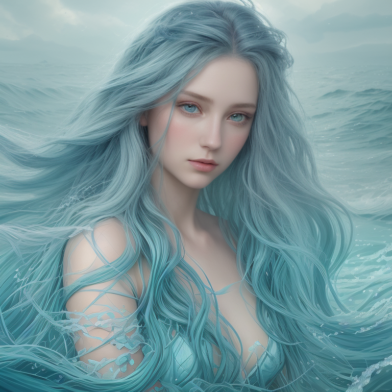

<p align="center">
  
</p>

<h2 align="center">Your Portal to AI Artistry, Forged for Intel ARC GPUs 🎨</h2>

<p align="center">
  <a href="https://opensource.org/licenses/MIT">
    
  </a>
  <a href="https://www.intel.com/content/www/us/en/products/docs/arc-discrete-graphics.html">
    
  </a>
  <a href="https://github.com/Md-Siam-Mia-Man/ArtTic-LAB/stargazers">
    
  </a>
  <a href="https://github.com/Md-Siam-Mia-Man/ArtTic-LAB/issues">
    
  </a>
</p>

---

ArtTic-LAB is a **modern, clean, and powerful** AI image generation suite, meticulously crafted for the Intel® Arc™ hardware ecosystem.
It provides a beautiful **custom graphical UI** as the primary experience, with a **robust CLI** as an alternative for scripting and automation.

This isn’t just a wrapper — it’s a ground-up application focused on **performance, aesthetics, and a frictionless user experience**.
With full support for models from **Stable Diffusion 1.5 → SDXL → SD3 → FLUX**, ArtTic-LAB is the definitive creative tool for ARC users. ✨

---

## 🧭 Two Ways to Create

ArtTic-LAB adapts to your preferred workflow — visual or terminal-based.

<div style="display: flex; justify-content: center; align-items: center; gap: 20px; flex-wrap: wrap;">
  <div style="text-align: center;">
    <p>GUI (Light)</p>
    
  </div>
  <div style="text-align: center;">
    <p>GUI (Dark)</p>
    
  </div>
  <div style="text-align: center;">
    <p>The CLI</p>
    
  </div>
</div>


---

## 🔬 Feature Deep Dive

We’ve packed ArtTic-LAB with features designed to maximize performance and streamline your creative process.

<div align="center">

| Feature Group                  | Description                                                                                                                                                                                                                                                      |
| :----------------------------- | :--------------------------------------------------------------------------------------------------------------------------------------------------------------------------------------------------------------------------------------------------------------- |
| **Engineered for Speed 🏎️**    | **IPEX Optimization:** Uses Intel® Extension for PyTorch (IPEX) to JIT-optimize model components (UNet, VAE) for ARC GPUs.<br>**Mixed Precision:** All generations run in `bfloat16` for ~2× faster performance and ~50% VRAM savings with minimal quality loss. |
| **Intelligent Pipeline 🧠**    | **Auto Model Detection:** Detects architecture (SD1.5 → SD3 → FLUX) from `.safetensors` and loads the right pipeline automatically.<br>**VRAM-Aware Guidance:** Estimates safe maximum resolution to prevent OOM errors before generating.                       |
| **Total VRAM Control 💧**      | **Proactive OOM Prevention:** Smart resolution limits and one-click model unload.<br>**VAE Tiling & CPU Offloading:** Generate high-res art with minimal VRAM usage.                                                                                             |
| **Streamlined for Artists ✨** | **Responsive Async UI:** No freezes while generating.<br>**Unified Image Viewer:** Smooth zoom, drag, and gallery controls.<br>**Full Parameter Control:** Prompt, CFG, LoRA, samplers — all unified in a fluid node-based interface.                            |

</div>

---

## 📸 Creations Gallery

|                               |                               |                                 |
| :---------------------------: | :---------------------------: | :-----------------------------: |
|  |  |    |
|  |  |    |
|  |  |  |

---

## 🚀 Get Started in Minutes

Launch your personal AI art studio in three simple steps.

### 1️⃣ Prerequisites

- Install **Miniconda** or **Miniforge**.
- After installation, **reopen your terminal** to ensure `conda` is available.

### 2️⃣ Installation

Download and unzip this project, then run the one-time installer:

- **Windows 🪟:** `install.bat`
- **Linux/macOS 🐧:** `chmod +x ./install.sh && ./install.sh`

### 3️⃣ Launch & Create!

Start the server:

- **Windows:** `start.bat`
- **Linux/macOS:** `./start.sh`

Then open the provided local URL (e.g. `http://127.0.0.1:7860`) in your browser.

<details>
<summary><strong>👉 Optional Launch Arguments</strong></summary>

- `--disable-filters` → Enable full logs for debugging.
</details>

---

## 📂 Project Structure

```bash
ArtTic-LAB/
├── 📁assets/        # Banners, demos, UI screenshots
├── 📁core/          # Core application logic
├── 📁helpers/       # CLI manager & utilities
├── 📁models/        # Drop your .safetensors models here
├── 📁outputs/       # Generated masterpieces
├── 📁pipelines/     # Core logic for SD model variants
├── 📁web/           # Custom FastAPI web UI
├── 📜app.py         # Main application launcher
├── 📜install.bat    # Windows one-click installer
├── 📜start.bat      # Windows launcher
└── 📜...            # Additional project files
```
